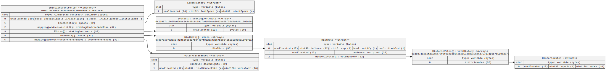
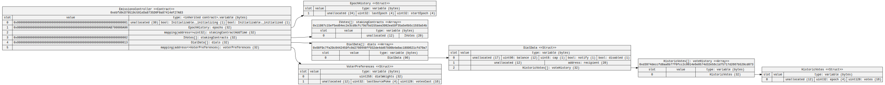
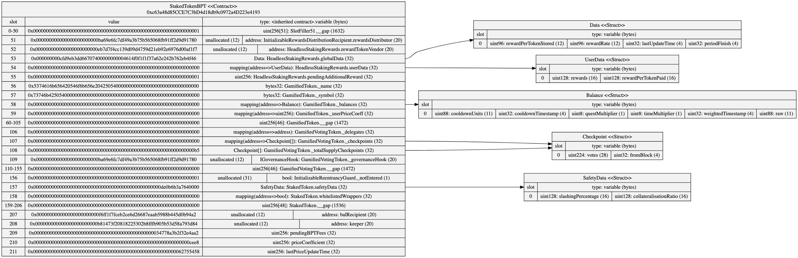
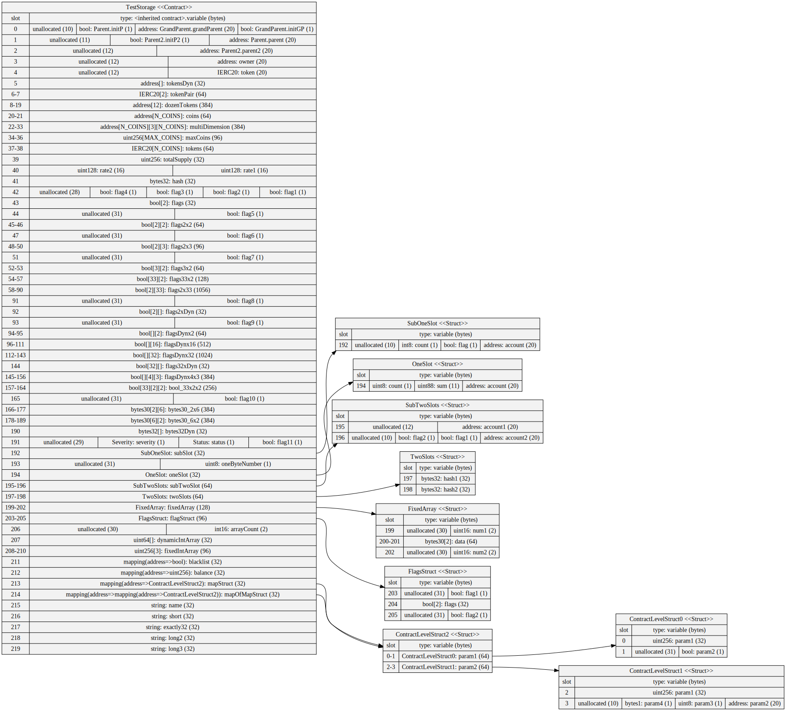
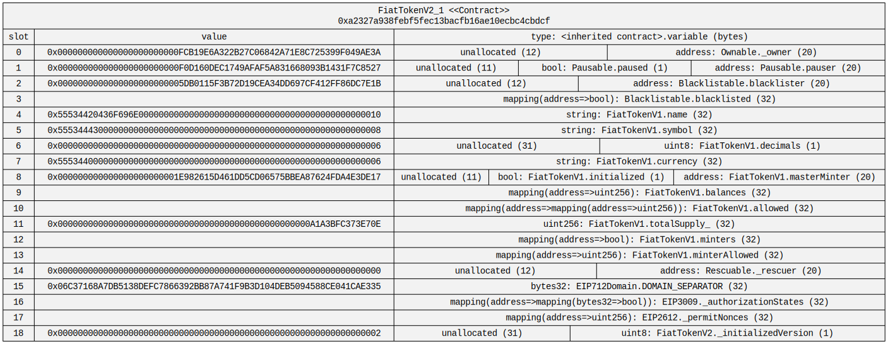
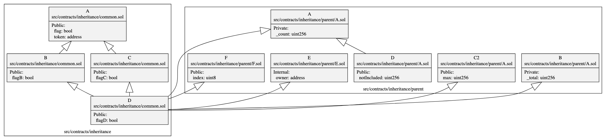
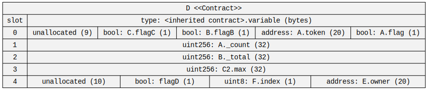

# Example Storage Diagrams

## mStable Emissions Controller

The [mStable](https://mstable.org/) Emissions Controller is deployed on mainnet to [0xBa69e6FC7Df49a3b75b565068Fb91ff2d9d91780](https://etherscan.io/address/0xBa69e6FC7Df49a3b75b565068Fb91ff2d9d91780).
This is a proxy contract so to visualise the storage layout sol2uml needs to be run against the proxy implementation [0xebfd9cD78510c591eDa8735D0F8a87414eF27A83](https://etherscan.io/address/0xebfd9cd78510c591eda8735d0f8a87414ef27a83).

By default, the output file will be saved in the current working directory using the contract name as the filename in svg format. In this case, it'll be `EmissionsController.svg`.

```
sol2uml storage 0xebfd9cD78510c591eDa8735D0F8a87414eF27A83
```




To visualise the data in the storage slots, the `-d --data` option is used.
As this is a proxied contract, the `-s --storage` option is used with the proxy contract address.
The `-u ---url` option can be used to tell which Ethereum node to get the storage values. Alternatively, the `NODE_URL` environment variable can be set.

```
export NODE_URL=https://your-node-url
sol2uml storage 0xebfd9cD78510c591eDa8735D0F8a87414eF27A83 -d -s 0xBa69e6FC7Df49a3b75b565068Fb91ff2d9d91780
```



## mStable Staking contract for MTA/ETH 80/20 Balancer Pool Token (BPT)

The `-f --format` option is used to output in svg, png or dot formats.

```
sol2uml storage 0xc63a48d85CCE7C3bD4d18db9c0972a4D223e4193 -d -s 0xeFbe22085D9f29863Cfb77EEd16d3cC0D927b011 -f png -o examples/storage/StakedTokenBPT.png
```




## Local Test Contract

The below storage diagram is an example from this repository [TestStorage.sol](../../src/contracts/TestStorage.sol).
Instead of specifying a contract address, this example uses the folder `./src/contracts`. All solidity contracts under this folder are parsed and can be visualised.
The `-c --contract` option specifies the contract name the storage should be visualised for.

```
sol2uml storage ./src/contracts -c TestStorage -o examples/storage
```



## USDC

USDC storage slots from the [verified source code](https://etherscan.io/address/0xa2327a938febf5fec13bacfb16ae10ecbc4cbdcf#code) on Etherscan.

The `-d --data` option is used to get the values of the storage slots from mainnet.
As this is a proxied contract, the `-s --storage` option is used with the proxy contract address [0xA0b86991c6218b36c1d19D4a2e9Eb0cE3606eB48](https://etherscan.io/address/0xA0b86991c6218b36c1d19D4a2e9Eb0cE3606eB48).
The `-u ---url` option is used to tell which Ethereum node to get the storage values.

```
sol2uml storage 0xa2327a938febf5fec13bacfb16ae10ecbc4cbdcf -d -s 0xA0b86991c6218b36c1d19D4a2e9Eb0cE3606eB48 -u https://your-url
```



## Contract Inheritance

The following example shows the storage slots with contract inheritance. This includes diamond inheritance, imports from other files and import aliases.



```
sol2uml class -c -f png -o examples/inheritanceDiamond.png ./src/contracts/inheritance
```

The storage slots for contract `D` in [inheritance/common.sol](../../src/contracts/inheritance/common.sol).



```
sol2uml storage -c D -o examples/storage/inheritanceStorage.svg ./src/contracts/inheritance
```
