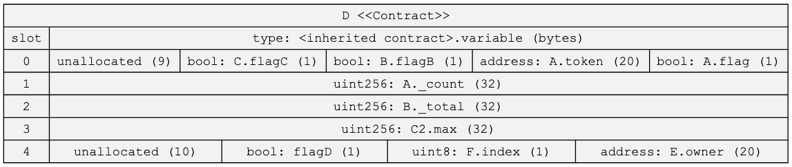

# Example Storage Diagrams

## mStable MTA Staking V2

Any struct used in storage is shown displaying their slot configurations. These structs can be a type of a storage variable or using in a mapping or array.


Generated from running

```
sol2uml storage 0xc63a48d85CCE7C3bD4d18db9c0972a4D223e4193 -f png -o examples/storage/StakedTokenBPT.png
```

## mStable Emissions Controller

The mStable Emissions Controller is deployed on mainnet to [0xBa69e6FC7Df49a3b75b565068Fb91ff2d9d91780](https://etherscan.io/address/0xBa69e6FC7Df49a3b75b565068Fb91ff2d9d91780).
This is a proxy contract so to visualise the storage layout sol2uml needs to be run against the proxy implementation [0xebfd9cD78510c591eDa8735D0F8a87414eF27A83](https://etherscan.io/address/0xebfd9cd78510c591eda8735d0f8a87414ef27a83).


```
sol2uml storage 0xebfd9cD78510c591eDa8735D0F8a87414eF27A83 -o ./examples/storage/ -f png
```

## Local Test Contract


The above is an example from this repository [TestStorage.sol](../../src/contracts/TestStorage.sol).

```
sol2uml storage -v -c TestStorage -i build,_flat -f png -o examples/storage/TestStorage.png ./src/contracts
```

## USDC

USDC storage slots from the [verified source code](https://etherscan.io/address/0xa2327a938febf5fec13bacfb16ae10ecbc4cbdcf#code) on Etherscan.


Generated from running

```
sol2uml storage -v -f png -o examples/storage/usdc.png 0xa2327a938febf5fec13bacfb16ae10ecbc4cbdcf
```

## Contract Inheritance

The following example shows the storage slots with contract inheritance. This includes diamond inheritance, imports from other files and import aliases.


```
sol2uml class -c -f png -o examples/inheritanceDiamond.png ./src/contracts/inheritance
```

The storage slots for contract `D` in [inheritance/common.sol](../../src/contracts/inheritance/common.sol).



```
storage -v -c D -o examples/storage/inheritanceStorage.svg ./src/contracts/inheritance
```
