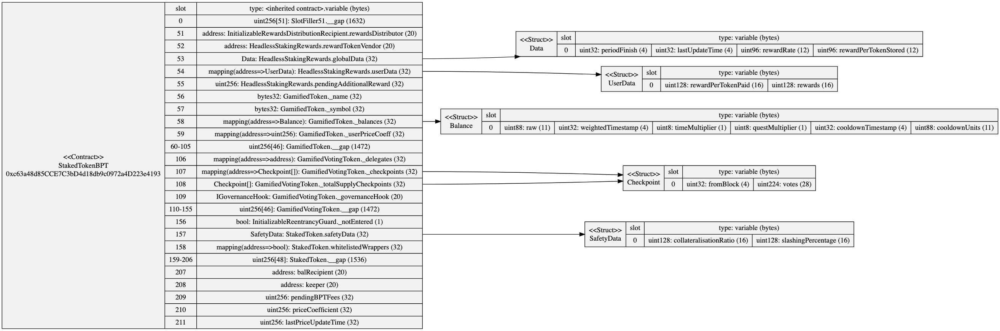
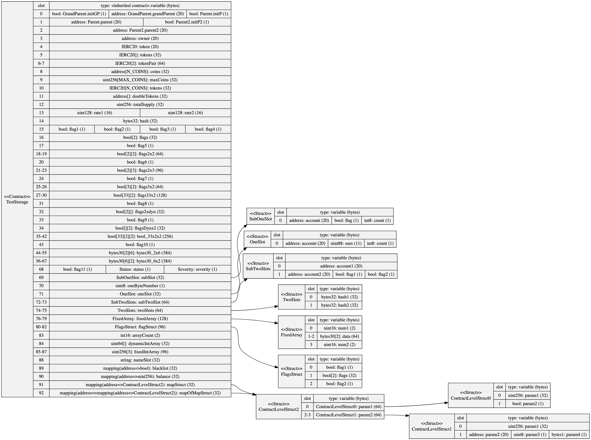
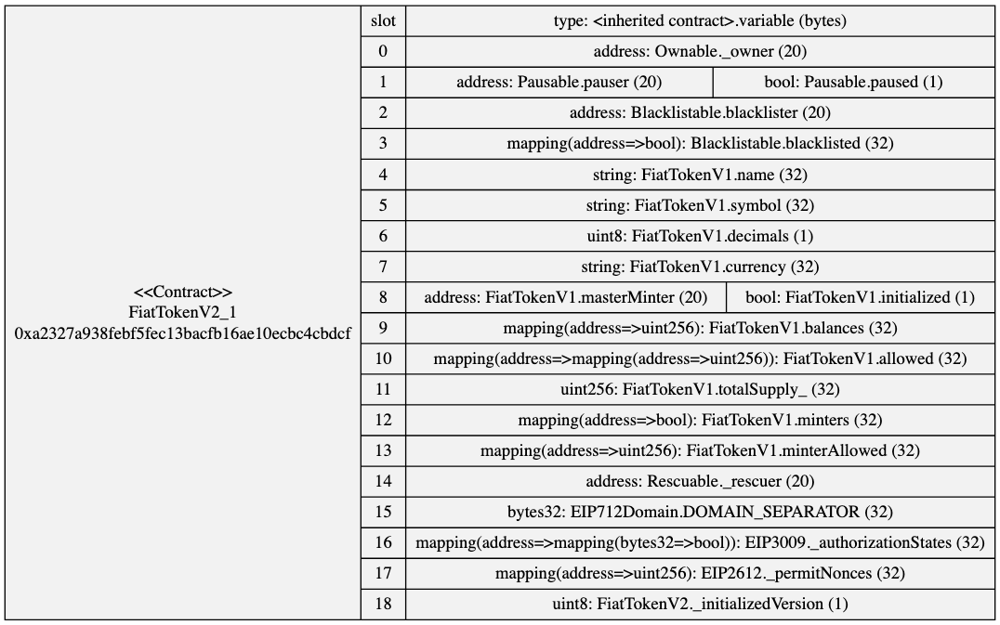
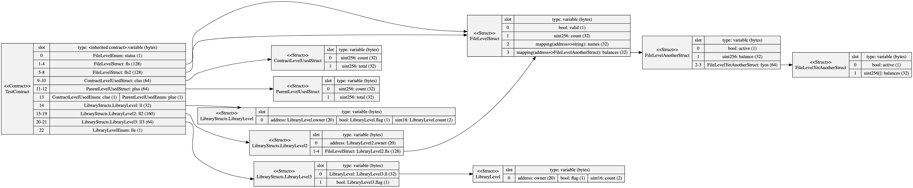

# Example Storage Diagrams

## mStable MTA Staking V2

Any struct used in storage is shown displaying their slot configurations. These structs can be a type of a storage variable or using in a mapping or array.



Generated from running
```
sol2uml storage 0xc63a48d85CCE7C3bD4d18db9c0972a4D223e4193 -f png -o examples/storage/StakedTokenBPT.png
```



The above is an example from this repository [TestStorage.sol](../../src/contracts/TestStorage.sol).

```
sol2uml storage -v -c TestStorage -i build,_flat -f png -o examples/storage/TestStorage.png ./src/contracts
```

## USDC

USDC storage slots from the [verified source code](https://etherscan.io/address/0xa2327a938febf5fec13bacfb16ae10ecbc4cbdcf#code) on Etherscan.



Generated from running
```
sol2uml storage -v -f png -o examples/storage/usdc.png 0xa2327a938febf5fec13bacfb16ae10ecbc4cbdcf
```

## Structs of structs

This is a contrived example where structs depend on other structs [fileLevel.sol](../../src/contracts/fileLevel.sol).



